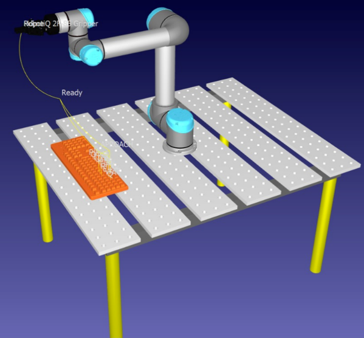

# Keyboard Input RoboDK

   

Typing a word using a UR5 and a standard keyboard using a Python program in RoboDK.

## Project Overview
Programming in RoboDK provides precise control over the robot's behavior, enabling complex movements, conditional logic, and task automation. That's why Python programming is utilized in this project to enable our UR5 robot to type any word on the keyboard. The programming code will prompt the user to input the word to be typed by the UR5 robot when it reaches a specified position.
  
  
  
## Content List
- [Keyboard Input RoboDK](#keyboard-input-robodk)  
- [Project Overview](#project-overview)  
- [Requirements](#requirements)
- [Robot kinematics](#robot-kinematics)
  - [Denavit-Hartenberg parameters](#denavit-hartenberg-parameters)
  - [Obtaining and Validation of the Forward Kinematics and Inverse Kinematics using Matlab](#obtaining-and-validation-of-the-forward-kinematics-and-inverse-kinematics-using-matlab)
- [Initial Setup](#initial-setup)
  - [Installation](#installation)
  - [Open CR](#open-cr)
  - [Simulation](#simulation)
  - [Changes in the original project](#changes-in-the-original-project)
- [Add New Things](#add-new-things)
- [Important Links](#important-links)
- [Contact](#contact)
## Requirements

To run this project you need the following components:

- RoboDK
- Virtual Robot UR5
- Virtual Table
- CAD of a Keyboard
- Python program
## Contact 

Authors:

Luis Fernando Cesar Denicia - luis.cesarda@udlap.mx - Github: LCesarDa

Jordán Joaquín Coronel Pérez - jordan.coronelpz@udlap.mx - Github: 

Jorge Zapata Hernández - jorge.zapatahz@udlap.mx - Github: JorgeZH1905

Project Link:

