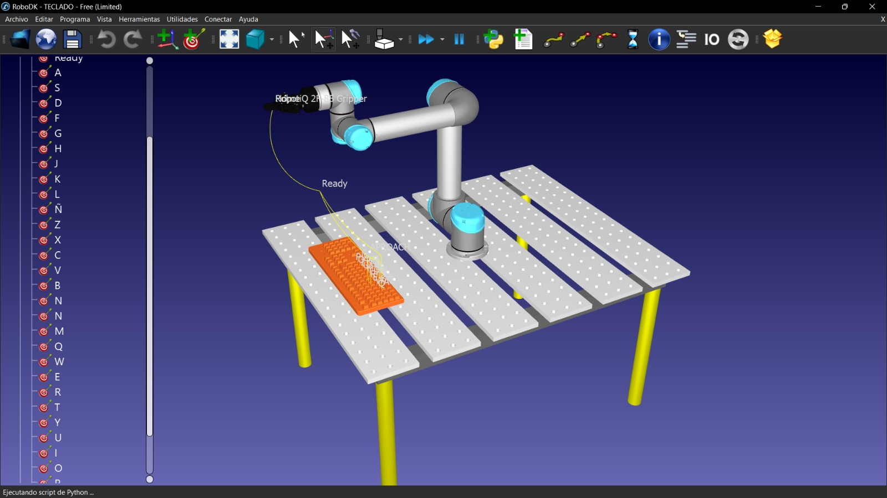

# Keyboard Input RoboDK

   

Typing a word using a UR5 and a standard keyboard using a Python program in RoboDK.

## Project Overview
Programming in RoboDK provides precise control over the robot's behavior, enabling complex movements, conditional logic, and task automation. That's why Python programming is utilized in this project to enable our UR5 robot to type any word on the keyboard. The programming code will prompt the user to input the word to be typed by the UR5 robot when it reaches a specified position.
  
  
  
## Content List
- [Keyboard Input RoboDK](#keyboard-input-robodk)  
- [Project Overview](#project-overview)  
- [Requirements](#requirements)
- [Initial Setup](#initial-setup)
- [Project Development](#project-development)
- [Contact](#contact)

## Requirements
To run this project you need the following components:

- RoboDK
- Virtual Robot UR5
- Virtual Table
- CAD of a Keyboard
- Python program

# Robot kinematics
## Denavit-Hartenberg parameters
Since we are using the UR5 robot in this case, we can obtain its forward kinematics manually or using Peter Corke's toolbox in MATLAB. With this, we obtain the following results

  

 
Denavid Hartenberg parameters obtained manually with the robot's zero position.

## Initial Setup

## Installation
First, we need to open RoboDK and generate the workspace. In this case, we decided to use the UR5, a welding table, and an STL CAD model of an HP keyboard. Actually, this program can be done solely with the robot and it's not necessarily required to use the UR5. It can be any robot from another brand or with different degrees of freedom, as long as it can reach the targets. For example, a SCARA robot might have trouble doing this, as well as a one-degree-of-freedom robot
 

  

 
Robot workspace.
 
The next step, once we have everything set up as we want it, is to start adding the targets. It's worth noting that we used a closed gripper to simulate a finger pressing the keyboard, but it can definitely be done without it, although visually it may not look very good. In this case, we assigned three movements to set the positions of Home, Ready, and Approach that we can use for all movements. Below is the tree of operations along with the components used.

  

 
RoboDK operation tree.

We can see that at the end of everything, we have a selected Python file. This will be responsible for allowing us to manipulate the robot to type the desired word.
It is also worth mentioning that for this case, we did not include the use of spaces or other special characters. However, if necessary, the corresponding targets can be generated and it should theoretically work without any extra changes to the code.

## Contact 

Authors:

Luis Fernando Cesar Denicia - luis.cesarda@udlap.mx - Github: LCesarDa

Jordán Joaquín Coronel Pérez - jordan.coronelpz@udlap.mx - Github: JordanCoronel

Jorge Zapata Hernández - jorge.zapatahz@udlap.mx - Github: JorgeZH1905

Project Link:

